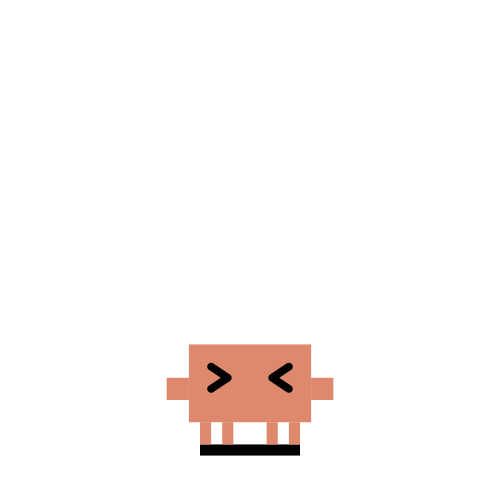

# Petodo 像素桌宠番茄钟

这是一个课程大作业项目，目标是做一个结合番茄钟和桌宠的桌面应用。当前保留 Clawd 和罗小黑两个独立桌宠主题。

当前版本已经完成基础展示链路：前端可以打开 Electron 主窗口和桌宠窗口，后端可以启动 FastAPI 服务，主窗口和桌宠窗口会读取后端总状态并同步展示，完成专注后可以获得积分，补给商店会按积分兑换食物。专注完成时，主窗口会弹出恭喜提示并播放烟花，宠物会先进入 happy 状态，再切到 rest 休息状态。

## 项目目录

```text
petodo-pet-app/
├── frontend/
│   ├── main.js
│   ├── preload.js
│   ├── index.html
│   ├── renderer.js
│   ├── style.css
│   ├── pet_window.html
│   ├── pet_window.js
│   └── package.json
├── backend/
│   ├── main.py
│   ├── models.py
│   ├── storage.py
│   ├── requirements.txt
│   └── data/
└── README.md
```

## 前端启动

进入前端目录：

```bash
cd frontend
npm install
npm start
```

运行后会打开 Electron 主窗口，并显示桌宠窗口。默认桌宠主题是罗小黑，Clawd 作为另一个独立主题保留。

## 后端启动

进入后端目录：

```bash
cd backend
python -m pip install -r requirements.txt
python -m uvicorn main:app --reload
```

启动后可以访问：

- http://127.0.0.1:8000/
- http://127.0.0.1:8000/health

## 课程展示启动顺序

建议先启动后端，再启动前端。

第一个终端：

```bash
cd backend
python -m uvicorn main:app --reload
```

第二个终端：

```bash
cd frontend
npm start
```

这样主窗口里的投喂按钮、补给商店兑换按钮和桌宠窗口状态都能通过后端同步。完成一次专注会获得 20 积分；点击“投喂”或兑换小鱼干、虾仁、海鲜拼盘时，会先检查积分是否足够，成功后扣除积分并让桌宠切换到 eating 和 finished_eating 状态。

## 当前最小运行效果

- Electron 主窗口可以正常打开
- 桌宠窗口已有罗小黑和 Clawd 两个独立桌宠主题
- README、项目进度文档、主窗口和桌宠窗口的展示文字可以正常阅读
- FastAPI 后端可以返回基础运行状态
- 主窗口可以显示番茄钟、待办清单、饥饿值、完成次数、当前积分和补给商店
- 主窗口倒计时会逐秒平滑显示，避免从 37 秒直接跳到 35 秒
- 专注完成后会弹出“恭喜计时完成”提示，并显示烟花效果
- 主窗口投喂按钮和补给商店兑换按钮已接入积分扣减
- 桌宠窗口可以根据后端状态切换动画，并显示头顶倒计时
- 右键点击小黑会打开功能面板，可进行睡觉、吃饭、玩一玩、番茄钟控制、缩放、置顶、隐藏和退出等操作

## Clawd 桌宠状态设计

Clawd 是项目保留的独立桌宠主题，参考 clawd-on-desk 的桌宠状态表现方式，将番茄钟、饥饿值和喂食行为映射到不同的 Clawd 动画状态。

| 状态 | 对应表现 | 触发条件 |
| --- | --- | --- |
| idle | 默认待机 | 无特殊事件 |
| focus | typing.gif | 番茄钟专注中 |
| rest | idle-reading.gif | 专注结束后的休息阶段 |
| happy | happy.gif | 完成一次专注后 |
| sleep | sleep.gif | 长时间未操作 |
| hungry | thinking.gif + food? 气泡 | 饥饿 |
| angry | 发火掀桌子 | 重度饥饿 |
| eating | 进食动画 | 用户喂食 |
| finished_eating | juggling.gif | 吃完后开心反馈 |

## 动画映射图

### Clawd

<table>
  <tr>
    <td align="center"><br>idle<br>默认待机</td>
    <td align="center"><br>focus<br>专注中</td>
    <td align="center"><br>rest<br>休息</td>
    <td align="center"><br>happy<br>完成专注</td>
    <td align="center"><br>sleep<br>睡觉</td>
    <td align="center"><br>hungry / eating<br>饥饿或进食</td>
  </tr>
  <tr>
    <td align="center"><br>angry<br>生气</td>
    <td align="center"><br>finished_eating<br>吃饱反馈</td>
    <td align="center"><br>drag<br>拖动</td>
    <td align="center"><br>tap<br>点击反馈</td>
  </tr>
</table>

### 罗小黑

<table>
  <tr>
    <td align="center"><br>idle_1<br>默认待机</td>
    <td align="center"><br>idle_2<br>长时间待机</td>
    <td align="center"><br>focus<br>专注中</td>
    <td align="center"><br>rest<br>休息</td>
    <td align="center"><br>happy<br>完成专注</td>
    <td align="center"><br>sleep<br>睡觉</td>
  </tr>
  <tr>
    <td align="center"><br>hungry<br>饥饿</td>
    <td align="center"><br>hungry_heavy<br>重度饥饿</td>
    <td align="center"><br>angry<br>生气</td>
    <td align="center"><br>eating<br>进食</td>
    <td align="center"><br>finished_eating<br>吃饱反馈</td>
    <td align="center"><br>greet<br>打招呼</td>
  </tr>
  <tr>
    <td align="center"><br>run<br>跑步</td>
    <td align="center"><br>tap<br>连续点击</td>
    <td align="center"><br>roll<br>打滚</td>
    <td align="center"><br>surf<br>冲浪</td>
    <td align="center"><br>guitar<br>弹吉他</td>
    <td align="center"><br>scratch<br>磨爪子</td>
  </tr>
  <tr>
    <td align="center"><br>stretch<br>伸懒腰</td>
    <td align="center"><br>drag<br>拖动</td>
  </tr>
</table>

## 罗小黑桌宠状态设计

罗小黑是另一个独立桌宠主题，不和 Clawd 共用角色设定。它使用单独的 `luoxiaohei` 主题资源，根据同一套桌宠状态切换到对应的罗小黑表情包或 GIF。

| 状态 | 对应表现 | 触发条件 |
| --- | --- | --- |
| idle_1 | 罗小黑默认待机 | 打开桌宠后、动作结束后、无特殊事件 |
| idle_2 | 原待机动画 | 番茄钟未运行且待机 2 分钟后 |
| focus | 专注状态表情 | 番茄钟专注中 |
| rest | 舔爪休息动画 | 专注结束后的休息阶段 |
| happy | 新的开心反馈动画 | 完成一次专注后 |
| sleep | 200×200 趴着睡觉动画 | 长时间未操作 |
| hungry | 饥饿表情 + food? 气泡 | 普通饥饿 |
| hungry_heavy | 趴倒没力气 + hungry 气泡 | 重度饥饿，尚未生气 |
| angry | 掀桌动画 + hungry 气泡 | 极低饱食度或长时间饥饿后 |
| eating | 吃鸡腿动画 | 用户喂食 |
| finished_eating | 吃饱反馈动画 | 吃完后开心反馈 |
| greet | 打招呼动画 | 鼠标单击一次小黑或右键功能面板选择“打招呼” |
| run | 跑步动画 | 右键功能面板选择“跑步” |
| tap | 连续点击反馈图 | 短时间内连续点击 |
| roll | 打滚动画 | 右键功能面板选择“打滚” |
| surf | 冲浪动画 | 右键功能面板选择“冲浪” |
| guitar | 弹吉他动画 | 右键功能面板选择“弹吉他” |
| scratch | 磨爪子动画 | 右键功能面板选择“磨爪子” |
| stretch | 伸懒腰动画 | 右键功能面板选择“伸懒腰” |
| drag | 拖动时保持当前显示图 | 移动桌宠窗口 |

## 暂未完成

- 完整历史统计展示
- 装饰商品兑换后的可视效果
