# Petodo 像素桌宠番茄钟

这是一个课程大作业项目，目标是做一个结合番茄钟和桌宠的桌面应用。当前只保留罗小黑桌宠主题。

当前版本已经完成基础展示链路：前端可以打开 Electron 主窗口和桌宠窗口，后端可以启动 FastAPI 服务，主窗口和桌宠窗口会读取后端总状态并同步展示。完成专注后可以获得积分和鱼饵，补给商店会按积分兑换食物；进入休息阶段后，小黑有概率邀请用户玩“休息钓鱼”小游戏。

## 项目目录

```text
petodo-pet-app/
├── frontend/
│   ├── main.js
│   ├── preload.js
│   ├── index.html
│   ├── renderer.js
│   ├── style.css
│   ├── pet_window.html
│   ├── pet_window.js
│   └── package.json
├── backend/
│   ├── main.py
│   ├── models.py
│   ├── storage.py
│   ├── requirements.txt
│   └── data/
└── README.md
```

## 前端启动

进入前端目录：

```bash
cd frontend
npm install
npm start
```

运行后会打开 Electron 主窗口，并显示罗小黑桌宠窗口。

## 后端启动

进入后端目录：

```bash
cd backend
python -m pip install -r requirements.txt
python -m uvicorn main:app --reload
```

启动后可以访问：

- http://127.0.0.1:8000/
- http://127.0.0.1:8000/health

## 课程展示启动顺序

建议先启动后端，再启动前端。

第一个终端：

```bash
cd backend
python -m uvicorn main:app --reload
```

第二个终端：

```bash
cd frontend
npm start
```

这样主窗口里的投喂按钮、补给商店兑换按钮、钓鱼奖励和桌宠窗口状态都能通过后端同步。完成一次专注会获得 20 积分和 1 个鱼饵；点击“投喂”或兑换补给时，会先检查积分是否足够，成功后扣除积分并让桌宠切换到进食反馈。

## 当前最小运行效果

- Electron 主窗口可以正常打开
- 桌宠窗口只保留罗小黑主题
- README、项目进度文档、主窗口和桌宠窗口的展示文字可以正常阅读
- FastAPI 后端可以返回基础运行状态
- 主窗口可以显示番茄钟、待办清单、饥饿值、完成次数、当前积分和补给商店
- 开始专注时会记住当前任务，完成后自动增加该任务的番茄进度；达到预计数量后仍由用户手动勾选是否完成
- 待办清单会按本机日期保存，跨天后询问是否延续未完成待办；已完成待办不会延续到第二天
- 主窗口倒计时会逐秒平滑显示，避免从 37 秒直接跳到 35 秒
- 专注完成后会弹出“恭喜计时完成”提示，并显示烟花效果
- 休息阶段会按鱼饵和保底规则随机邀请钓鱼，奖励会用图标弹出并保存到本地
- 主窗口投喂按钮和补给商店兑换按钮已接入积分扣减
- 桌宠窗口可以根据后端状态切换动画，并显示头顶倒计时
- 右键点击小黑会打开功能面板，可进行睡觉、吃饭、玩一玩、番茄钟控制、缩放、置顶、隐藏和退出等操作

## 动画映射图

### 罗小黑

<table>
  <tr>
    <td align="center">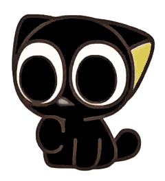<br>idle_1<br>默认待机</td>
    <td align="center">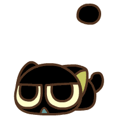<br>idle_2<br>长时间待机</td>
    <td align="center">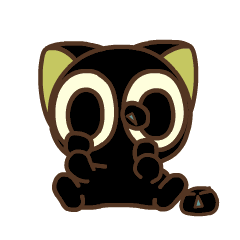<br>focus<br>专注中</td>
    <td align="center">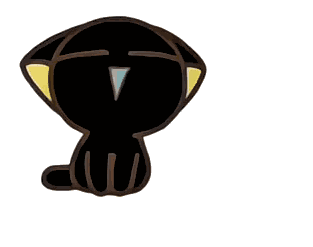<br>rest<br>休息</td>
    <td align="center">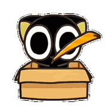<br>happy<br>完成专注</td>
    <td align="center">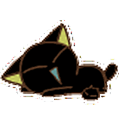<br>sleep<br>睡觉</td>
  </tr>
  <tr>
    <td align="center">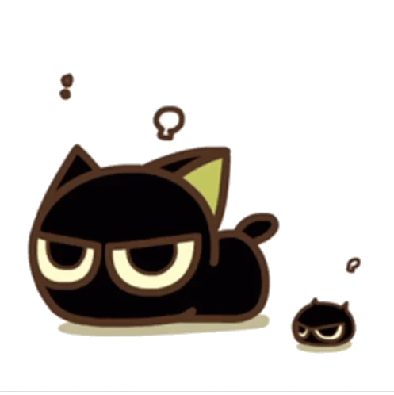<br>hungry<br>饥饿</td>
    <td align="center">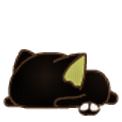<br>hungry_heavy<br>重度饥饿</td>
    <td align="center">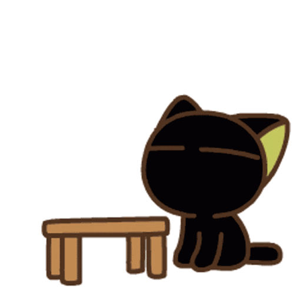<br>angry<br>生气</td>
    <td align="center">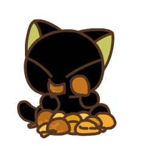<br>eating<br>进食</td>
    <td align="center">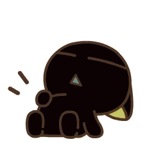<br>finished_eating<br>吃饱反馈</td>
    <td align="center">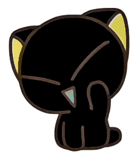<br>greet<br>打招呼</td>
  </tr>
  <tr>
    <td align="center">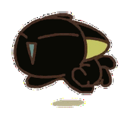<br>run<br>跑步</td>
    <td align="center">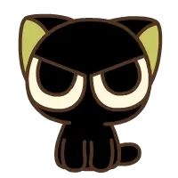<br>tap<br>连续点击</td>
    <td align="center">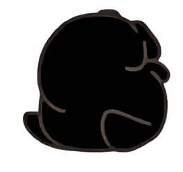<br>roll<br>打滚</td>
    <td align="center">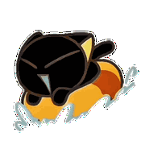<br>surf<br>冲浪</td>
    <td align="center">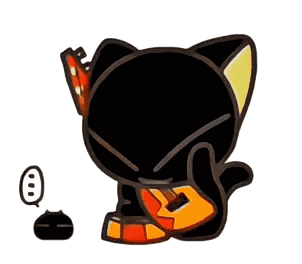<br>guitar<br>弹吉他</td>
    <td align="center">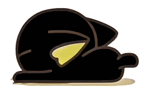<br>scratch<br>磨爪子</td>
  </tr>
  <tr>
    <td align="center"><br>stretch<br>伸懒腰</td>
    <td align="center">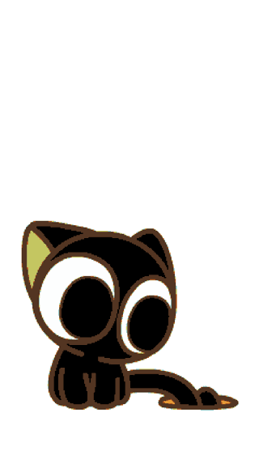<br>fishing<br>休息钓鱼</td>
    <td align="center"><br>drag<br>拖动</td>
  </tr>
</table>

## 罗小黑桌宠状态设计

罗小黑是当前唯一保留的桌宠主题，会根据番茄钟、饥饿值和互动行为切换对应表现。

| 状态 | 对应表现 | 触发条件 |
| --- | --- | --- |
| idle_1 | 罗小黑默认待机 | 打开桌宠后、动作结束后、无特殊事件 |
| idle_2 | 原待机动画 | 番茄钟未运行且待机 2 分钟后 |
| focus | 专注状态表情 | 番茄钟专注中 |
| rest | 舔爪休息动画 | 专注结束后的休息阶段 |
| fishing | 钓鱼动画 | 休息阶段接受钓鱼邀请后 |
| happy | 新的开心反馈动画 | 完成一次专注后 |
| sleep | 200×200 趴着睡觉动画 | 长时间未操作 |
| hungry | 饥饿表情 + food? 气泡 | 普通饥饿 |
| hungry_heavy | 趴倒没力气 + hungry 气泡 | 重度饥饿，尚未生气 |
| angry | 掀桌动画 + hungry 气泡 | 极低饱食度或长时间饥饿后 |
| eating | 通用吃饭动画 | 兜底进食状态 |
| eating_hamburger | 吃汉堡静态图 | 用户喂食汉堡 |
| eating_pizza | 吃披萨动画 | 用户喂食披萨 |
| eating_chicken_leg | 吃鸡腿静态图 | 用户喂食鸡腿 |
| finished_eating | 吃饱反馈动画 | 吃完后开心反馈 |
| greet | 打招呼动画 | 鼠标单击一次小黑或右键功能面板选择“打招呼” |
| run | 跑步动画 | 右键功能面板选择“跑步” |
| tap | 连续点击反馈图 | 短时间内连续点击 |
| roll | 打滚动画 | 右键功能面板选择“打滚” |
| surf | 冲浪动画 | 右键功能面板选择“冲浪” |
| guitar | 弹吉他动画 | 右键功能面板选择“弹吉他” |
| scratch | 磨爪子动画 | 右键功能面板选择“磨爪子” |
| stretch | 伸懒腰动画 | 右键功能面板选择“伸懒腰” |
| drag | 拖动时保持当前显示图 | 移动桌宠窗口 |

## 休息钓鱼小游戏

- 完成 1 个番茄钟会获得 1 个鱼饵。
- 进入休息阶段后，小黑会按 35%、70%、100% 的规则随机发出钓鱼邀请；没有鱼饵时不会邀请。
- 接受邀请后会播放钓鱼动画 4 秒，随后弹出奖励图标。
- 奖励包括小鱼干、普通鱼、积分、金色鱼和破靴子；小鱼干、普通鱼和金色鱼会显示在右键小黑背包里。
- 鱼饵、钓鱼次数、鱼类收藏和钓鱼获得的额外积分都会保存到本地。

## 暂未完成

- 完整历史统计展示
- 装饰商品兑换后的可视效果
