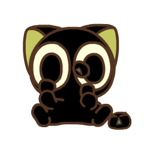
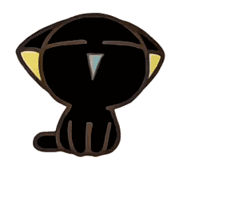
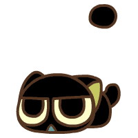
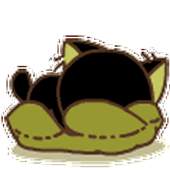
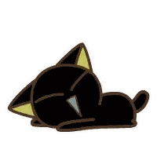
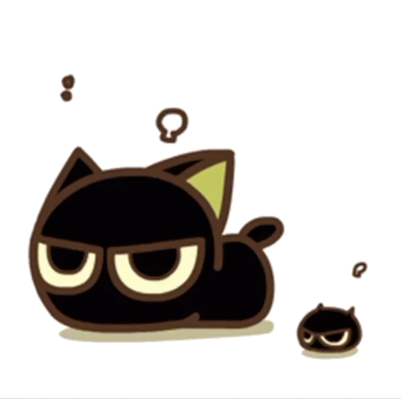
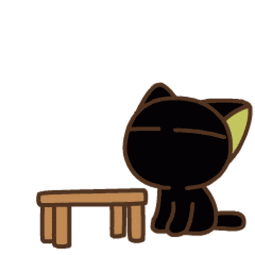
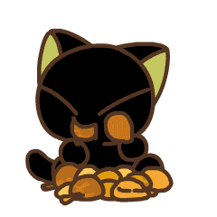
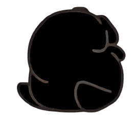

<p align="center">
  
</p>

<h1 align="center">Petodo</h1>

<p align="center">
  番茄钟、待办清单、未来倒计时和罗小黑桌面陪伴结合的学习桌面应用
</p>

<p align="center">
  
  
  
  
</p>

<p align="center">
  
  
  
</p>

Petodo 是一个面向学习和课程展示的桌面应用。主窗口负责番茄钟、待办、记录、补给商店和未来倒计时；罗小黑会以独立透明窗口停在桌面上，根据专注、休息、饥饿、投喂和互动状态切换表现。

完成一次专注会获得积分和鱼饵。积分可以在补给商店兑换食物，鱼饵可以在休息阶段触发钓鱼小游戏。主窗口和桌面陪伴窗口都会从同一个后端状态读取数据，尽量保持展示一致。

## Features

### 学习流程

- **番茄钟**：支持开始、暂停、继续和重置。
- **短休息和长休息**：完成专注后进入休息；每完成 4 次专注进入一次更长的休息。
- **完成反馈**：专注结束后会出现完成提示，罗小黑也会切换到开心或休息表现。
- **学习记录**：记录完成次数、累计时长、连续学习天数和最近完成记录。

### 待办清单

- **当日任务**：添加、删除、勾选待办，并把某个待办设为当前专注任务。
- **任务进度**：开始专注时锁定当时选中的任务，完成后把本次专注计入对应任务。
- **跨天提醒**：第二天打开应用时，会询问是否延续未完成待办。
- **桌面待办小组件**：可以打开独立待办窗口，作为桌面上的轻量提醒。

### 罗小黑桌面陪伴

- **独立透明窗口**：罗小黑可以停在桌面上，支持拖动、缩放、置顶、隐藏和退出。
- **状态同步**：桌面窗口会跟随番茄钟、饥饿值、投喂、休息和账号状态变化。
- **右键功能面板**：可以打开背包、睡觉、吃饭、玩一玩、番茄钟控制、缩放和窗口操作。
- **点击互动**：支持打招呼、跑步、打滚、冲浪、弹吉他、磨爪子、伸懒腰等动作。

### 补给和背包

- **积分奖励**：完成专注会获得积分。
- **补给商店**：可以用积分兑换食物，兑换成功后触发投喂表现。
- **饥饿状态**：罗小黑会根据饥饿程度显示不同状态，投喂后恢复。
- **背包奖励**：钓鱼得到的小鱼干、普通鱼、金色鱼可以在背包里使用。

### 休息钓鱼

- **鱼饵来源**：完成专注会获得鱼饵。
- **休息邀请**：进入休息阶段后，罗小黑有机会邀请用户钓鱼。
- **结果反馈**：钓鱼结束后会弹出奖励图标。
- **本地保存**：鱼饵、钓鱼次数、鱼类收藏和额外积分会保存到本地数据中。

### 未来倒计时

- **目标管理**：添加目标名称、日期和备注。
- **自动计算**：根据本机日期显示距离目标还有几天、是否就是今天、或是否已结束。
- **本地保存**：刷新后仍然保留已添加的目标。
- **桌面倒计时小组件**：可以打开独立倒计时窗口，放在桌面上查看。

## Animations

当前应用只保留罗小黑这一套主题素材。下面是主要状态示例：

<table>
  <tr>
    <td align="center"><br><sub>默认待机</sub></td>
    <td align="center"><br><sub>长时间待机</sub></td>
    <td align="center"><br><sub>专注中</sub></td>
    <td align="center"><br><sub>短休息</sub></td>
    <td align="center"><br><sub>长休息开始</sub></td>
  </tr>
  <tr>
    <td align="center"><br><sub>睡觉</sub></td>
    <td align="center"><br><sub>饥饿</sub></td>
    <td align="center"><br><sub>生气</sub></td>
    <td align="center"><br><sub>吃饭</sub></td>
    <td align="center"><br><sub>吃饱反馈</sub></td>
  </tr>
  <tr>
    <td align="center"><br><sub>打招呼</sub></td>
    <td align="center"><br><sub>打滚</sub></td>
    <td align="center"><br><sub>弹吉他</sub></td>
    <td align="center"><br><sub>伸懒腰</sub></td>
    <td align="center"><br><sub>休息钓鱼</sub></td>
  </tr>
</table>

## Quick Start

### 方式一：一键启动

Windows 下可以直接双击：

```text
start_petodo.bat
```

这个脚本会准备后端环境、检查前端依赖，并依次启动后端服务和 Electron 前端。

### 方式二：手动启动

建议先启动后端，再启动前端。

第一个终端：

```bash
cd backend
python -m pip install -r requirements.txt
python -m uvicorn main:app --reload --host 127.0.0.1 --port 8000
```

后端启动后可以访问：

```text
http://127.0.0.1:8000/health
```

第二个终端：

```bash
cd frontend
npm install
npm start
```

运行后会打开 Petodo 主窗口，并显示罗小黑桌面陪伴窗口。

## Project Structure

```text
petodo-pet-app/
├── backend/
│   ├── main.py              # FastAPI 入口
│   ├── timer_logic.py       # 番茄钟逻辑
│   ├── pet_logic.py         # 罗小黑状态逻辑
│   ├── focus_records.py     # 专注记录
│   ├── shop_logic.py        # 补给商店
│   ├── fishing_logic.py     # 休息钓鱼
│   ├── account_auth.py      # 账号数据
│   ├── models.py            # 接口数据结构
│   └── tests/
├── frontend/
│   ├── main.js              # Electron 主进程
│   ├── preload.js           # 窗口桥接
│   ├── index.html           # 主窗口页面
│   ├── renderer.js          # 主窗口交互
│   ├── pet_window.html      # 罗小黑窗口
│   ├── pet_window.js        # 罗小黑窗口交互
│   ├── countdown_widget.*   # 倒计时小组件
│   ├── todo_widget.*        # 待办小组件
│   ├── config.js            # 后端地址配置
│   └── assets/              # 罗小黑和界面素材
├── start_petodo.bat
├── DEPLOY.md
└── README.md
```

## Tech Stack

| Area | Stack |
| --- | --- |
| 桌面端 | Electron |
| 前端页面 | HTML / CSS / JavaScript |
| 后端服务 | FastAPI |
| 后端运行 | Python / Uvicorn |
| 数据保存 | 本地 JSON 文件 |
| 测试 | Pytest |

## Configuration

前端通过 `frontend/config.js` 配置后端地址：

```js
window.PETODO_CONFIG = {
  API_BASE_URL: "http://127.0.0.1:8000"
};
```

如果后端部署在云服务器，需要把这个地址改成服务器地址。当前仓库中的配置可能指向已有服务器，做本地开发时请确认它是否符合你的运行方式。

## Development

### 后端测试

```bash
cd backend
python -m pytest tests/test_backend_main.py
```

### 前端语法检查

```bash
cd frontend
node --check main.js
node --check renderer.js
node --check pet_window.js
```

## Known Limitations

- 专注记录已经能显示基础历史数据，但按任务汇总的完整回顾页仍可继续完善。
- 补给商店中的装饰类商品还缺少兑换后的可视效果。
- 待办和未来倒计时目前主要保存在本机，跨设备同步还没有完成。
- 部分部署说明仍以课程展示和本地运行为主，正式分发流程还可以继续整理。

## Roadmap

- 完善按任务汇总的学习记录页面。
- 补齐装饰商品兑换后的桌面展示效果。
- 继续优化右键功能面板的布局和互动动作。
- 整理更稳定的一键安装或发布流程。

## License

当前仓库未声明明确许可证。使用、分发或二次开发前，请先确认代码和素材的授权范围。
